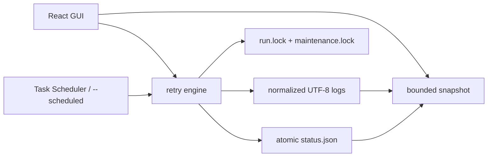

# Codex Launcher

Codex Launcher 是一个仅支持 Windows 的 Tauri 2 + React retry launcher。它在指定目录执行任意 shell command；成功时结束，非零退出或检测到 high-demand marker 时按配置重试。



## 主要行为

- GUI、`--scheduled` 与 `--headless` 共用 retry engine、配置、状态和 cross-process OS lock。
- `status.json` 会记录启动来源：GUI 手动、Windows 计划任务（`--scheduled`）或直接 Headless CLI；打开 GUI 时可观察并控制正在运行的计划任务。
- `maxTries` 表示“最大尝试次数（0 为无限）”：`1` 只执行一次，`3` 最多执行三次；并发运行时为所有线程累计。
- `concurrency` 表示“并发线程数（1–16，默认 1）”：大于 1 时多个线程并行执行同一条命令，任一线程成功即判定整个 run 成功并立即终止其余线程；保活循环固定单线程。
- Fresh install 的 command 为空；用户明确填写有效配置前，Start 保持 disabled，且不会自动保存可执行示例。
- GUI close 会取消本进程持有的 run，并等待 terminal status、日志 flush 和 lock cleanup；等待有 15 秒上限。
- 进程崩溃后，下一次启动或 snapshot poll 会用 `run.lock` 判断 owner 是否仍存活，并把 stale active status 恢复为 `failed`。
- stdout/stderr 按 logical line framing；磁盘日志统一为 UTF-8，并在 Windows 上对无效 UTF-8 使用当前 OEM code page fallback。
- 并发线程数为 1 时日志格式与单线程版本逐字节一致；大于 1 时每条记录带 `[wN]` 线程标记（`[时间] [w2] [stdout] …`），每个 (线程, 流) 各自维护 line framer，半行不会互相污染。实时终端的关键字过滤可直接用 `[w2]` 只看某个线程。
- GUI reconnect 到大型 active log 时只读取 bounded tail；完整日志仍保存在磁盘。
- Run-log creation 与“清历史”通过 `maintenance.lock` 串行化，active run log 和 `latest.log` 不会被删除。
- Backend errors 使用 bounded FIFO queue 逐个展示，不会被成功 poll 隐式清除。
- NSIS/MSI uninstall 会在删除主 EXE 前调用 `--uninstall-cleanup`，幂等移除已配置的 Scheduled Task。
- 个人微信通知使用 Server酱 Turbo；普通 retry 流程首次出现成功结果时发送一次，无论成功发生在第几次尝试。

## 个人微信通知（Server酱 Turbo）

在 [Server酱](https://sct.ftqq.com/) 创建 SendKey 后，打开 GUI 的“通知”Tab：

1. 输入 SendKey 并点击“保存凭据”。
2. 打开“启用通知”。
3. 点击“发送测试”确认个人微信可以收到消息。

SendKey 只写入当前 Windows 用户的 Credential Manager（service `CodexLauncher`、account `serverchan-sendkey`），不会写入 `launcher-config.json`、`status.json`、运行日志、`status.html` 或前端 autosave。UI 只保留一次性输入，保存成功后立即清空；“删除凭据”可以幂等清理该条目。

Server酱免费额度为每天 5 条。运行通知只有一个固定条件：普通 retry 流程首次出现成功结果。初始执行直接成功或任意后续重试成功都会发送；普通 retry 即使开启“本次保活”，后续 keep-alive cycle 也不会重复发送。最终失败、停止和独立 manual keep-alive 不发送；一次 run 最多发送一条。

通知发送是 bounded best-effort：HTTPS 请求固定到 `sctapi.ftqq.com`，连接 timeout 为 3 秒，完整 delivery 总预算不超过 8 秒；连接失败及明确的 transient HTTP 状态最多重试一次，响应确认超时不会自动重试，并提示“通知可能已送达”，避免重复消耗额度。HTTP/网络/API 失败只写入 `logs\\notifications.log`（上限 1 MiB），不会改变 run 的 terminal status、Headless exit code 或 GUI 主流程。第一版没有 durable outbox，断电或进程被强制终止时不保证补发。

卸载 NSIS/MSI 前会尝试删除 Credential Manager 中的 SendKey 和计划任务。凭据不存在视为成功；实际清理错误写入 `logs\\uninstall.log`，不会记录 SendKey 内容。

## 数据目录

所有运行数据位于 `%LOCALAPPDATA%\CodexLauncher\`：

```text
%LOCALAPPDATA%\CodexLauncher\
├── launcher-config.json
├── launcher-config.v1.backup.json
├── scheduler-state.json
├── status.json
├── status.html
├── run.lock
├── maintenance.lock
├── stop-request.json
├── keep-alive-request.json
├── webview2\
└── logs\
    ├── latest.log
    ├── codex-retry-<run-id>.log
    ├── headless.log
    ├── notifications.log
    ├── uninstall.log
    └── crash.log
```

首次启动且新配置不存在时，应用会从启动目录或 EXE 目录下的 `logs\launcher-config.json` copy-only 迁移 legacy 配置；不会删除或改写旧文件。损坏或无效的既有配置会返回包含文件路径的错误，不会静默重置。

配置格式当前为 V2。读取 V1 的 `dailyAt` 时会在内存中迁移为 Daily trigger；首次保存 V2 前，原始 V1 JSON 会 copy-only 写入 `launcher-config.v1.backup.json`，且不会覆盖已有备份。`scheduler-state.json` 只保存应用管理的任务名称、EXE 路径和已应用 schedule，不包含凭据。

## Windows 计划任务

计划任务 Action 使用当前 EXE 的 `--scheduled` 模式，因此 Dashboard 可以明确显示“Windows 定时任务”来源。Scheduled run 与 GUI run 继续共用 retry、多 worker、通知、保活、日志、状态和 `run.lock`。

可视化触发器支持：

- 每 N 天，在指定本地时间运行。
- 每 N 周，在一个或多个星期运行。
- 每月指定日期或最后一天，可限制月份。
- 每 N 分钟或每 N 小时运行，并指定对齐起始时间。
- 当前用户登录时运行，可配置延迟。
- Windows 启动时运行，可配置延迟。
- 严格五字段 Cron 子集。

Cron 使用 `minute hour day-of-month month day-of-week`，遵循 Windows 当前本地时区。支持分钟/小时步长、每日、每周及每月指定日期；不支持秒字段、`L/W/#/?`、同时限制 day-of-month 与 day-of-week，或任何需要多个 Windows trigger 才能准确表达的表达式。不支持的 Cron 会在调用 `schtasks` 前失败，不会近似执行。

计划任务健康面板通过 Windows ScheduledTasks PowerShell module 获取结构化 JSON，展示：注册/启用状态、Windows State、上下次运行时间、Last Run Result、Missed Runs、Action ownership、期望与已应用 schedule，以及改名后仍待清理的 managed task。

安装或更新任务会拒绝覆盖同名但 Action 不属于当前 Codex Launcher 的任务。任务改名采用“新任务创建并验证成功 → 记录 managed state → 删除旧任务”的顺序；旧任务删除失败会保留在健康面板中。移除 Windows 注册不会终止已经运行的进程，应使用 Dashboard 的“停止引擎”。

## Headless exit code

- `0`：run 成功。
- `1`：配置、启动或运行失败。
- `2`：run 被停止。

Release build 使用 Windows GUI subsystem，因此 Task Scheduler diagnostics 不依赖不可见的 stderr；失败会追加到 `logs\headless.log`。

## 本地开发

以下命令假设当前目录是 repository root。

启动 frontend：

```powershell
Set-Location 'ui'
npm ci
npm run dev
```

在另一个 terminal 从 repository root 启动 Tauri：

```powershell
cargo run --manifest-path 'src-tauri/Cargo.toml'
```

Headless 模式会读取已保存的有效配置，并阻塞到 terminal status：

```powershell
cargo run --manifest-path 'src-tauri/Cargo.toml' -- '--headless'
$LASTEXITCODE
```

`--headless` 表示直接 Headless CLI 来源；Windows Task Scheduler 使用内部参数 `--scheduled`。两者都会等待 run 结束并返回相同的 exit code。

## 构建与质量门禁

```powershell
Set-Location 'ui'
npm ci
npm run build
npm run lint
npm test
npm audit --omit=dev --registry 'https://registry.npmjs.org'

Set-Location '..\src-tauri'
cargo fmt --all -- --check
cargo clippy --all-targets --all-features -- -D 'warnings'
cargo test --all-targets --all-features
cargo build --release
```

Release EXE 位于 `src-tauri\target\release\codex-launcher.exe`。

## Release 脚本

`scripts\release.ps1` 会校验 `src-tauri\Cargo.toml` 与 `src-tauri\tauri.conf.json` 的版本一致，依次运行 frontend/Rust quality gates，构建 NSIS + MSI，并在 `artifacts\v<version>` 生成安装包与 `SHA256SUMS.txt`。

```powershell
# 只预览流程，不执行构建或发布
powershell -NoProfile -ExecutionPolicy Bypass -File '.\scripts\release.ps1' -DryRun

# 构建 unsigned 本地产物（默认不会发布）
powershell -NoProfile -ExecutionPolicy Bypass -File '.\scripts\release.ps1'

# 使用 README 下方所述证书环境变量，构建 signed 本地产物
powershell -NoProfile -ExecutionPolicy Bypass -File '.\scripts\release.ps1' -Signed

# 工作区干净时：构建、创建并推送 tag、发布 GitHub Release
powershell -NoProfile -ExecutionPolicy Bypass -File '.\scripts\release.ps1' -Version '2.2.0' -Signed -Publish
```

`-Version` 是 expected version（预期版本）校验，不会自动修改源码；发布新版本前应先同步两个版本文件并提交。`-Publish` 需要已登录的 GitHub CLI（`gh auth login`），也可搭配 `-Draft`、`-Prerelease` 或 `-NotesFile '.\RELEASE_NOTES.md'`。如果构建成功但 GitHub 发布失败，可以修复网络或权限后用同一命令重试；脚本会复用指向当前 commit 的 tag。

## Windows 安装包

Unsigned local bundle（开发/测试）：

```powershell
Set-Location 'ui'
npm ci
npm run bundle:unsigned

# 产物应为 unsigned；检查 Authenticode 状态和 SHA-256
Get-AuthenticodeSignature '..\\src-tauri\\target\\release\\bundle\\nsis\\Codex-Launcher_2.2.0_x64-setup.exe'
Get-FileHash '..\\src-tauri\\target\\release\\bundle\\nsis\\Codex-Launcher_2.2.0_x64-setup.exe' -Algorithm SHA256
Get-FileHash '..\\src-tauri\\target\\release\\bundle\\msi\\Codex-Launcher_2.2.0_x64_en-US.msi' -Algorithm SHA256
```

Signed bundle 要求证书已导入 Windows certificate store，并显式提供环境变量：

```powershell
$env:CODEX_LAUNCHER_CERT_THUMBPRINT = '<certificate thumbprint>'
$env:CODEX_LAUNCHER_TIMESTAMP_URL = '<issuer timestamp URL>'
$env:CODEX_LAUNCHER_DIGEST_ALGORITHM = 'sha256'
npm run bundle:signed
```

`bundle:signed` 不包含 `--no-sign`，缺少证书配置时会立即失败。只有 `Get-AuthenticodeSignature` 返回 `Valid` 时，才能把产物描述为已签名；code signing 也不等于立即获得 SmartScreen reputation。

默认产物：

- NSIS：`src-tauri\target\release\bundle\nsis\Codex-Launcher_2.2.0_x64-setup.exe`
- MSI：`src-tauri\target\release\bundle\msi\Codex-Launcher_2.2.0_x64_en-US.msi`

Installer customization 依据 Tauri 官方文档：

- [Windows Installer](https://v2.tauri.app/distribute/windows-installer/)
- [Windows Code Signing](https://v2.tauri.app/distribute/sign/windows/)

## Manual QA boundary

Automated tests 不会创建/删除当前机器的 Scheduled Task，也不会安装/卸载 bundle。下列场景应在 disposable Windows environment 中手工验证：各高级 trigger 与支持的 Cron → `schtasks /Query /XML` 核对；从 Task Scheduler 手动 Run → GUI 显示 Windows 定时任务来源并可 Stop/切换保活；改名后旧任务被清理；同名外部任务不会被覆盖；NSIS/MSI install → 创建任务 → uninstall → 所有 managed task 均不存在；以及缺失/损坏配置下 uninstall 仍能完成。
