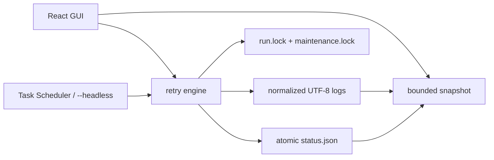

# Codex Launcher

Codex Launcher 是一个仅支持 Windows 的 Tauri 2 + React retry launcher。它在指定目录执行任意 shell command；成功时结束，非零退出或检测到 high-demand marker 时按配置重试。



## 主要行为

- GUI 与 `--headless` 共用 retry engine、配置、状态和 cross-process OS lock。
- `maxTries` 表示“最大尝试次数（0 为无限）”：`1` 只执行一次，`3` 最多执行三次。
- Fresh install 的 command 为空；用户明确填写有效配置前，Start 保持 disabled，且不会自动保存可执行示例。
- GUI close 会取消本进程持有的 run，并等待 terminal status、日志 flush 和 lock cleanup；等待有 15 秒上限。
- 进程崩溃后，下一次启动或 snapshot poll 会用 `run.lock` 判断 owner 是否仍存活，并把 stale active status 恢复为 `failed`。
- stdout/stderr 按 logical line framing；磁盘日志统一为 UTF-8，并在 Windows 上对无效 UTF-8 使用当前 OEM code page fallback。
- GUI reconnect 到大型 active log 时只读取 bounded tail；完整日志仍保存在磁盘。
- Run-log creation 与“清历史”通过 `maintenance.lock` 串行化，active run log 和 `latest.log` 不会被删除。
- Backend errors 使用 bounded FIFO queue 逐个展示，不会被成功 poll 隐式清除。
- NSIS/MSI uninstall 会在删除主 EXE 前调用 `--uninstall-cleanup`，幂等移除已配置的 Scheduled Task。

## 数据目录

所有运行数据位于 `%LOCALAPPDATA%\CodexLauncher\`：

```text
%LOCALAPPDATA%\CodexLauncher\
├── launcher-config.json
├── status.json
├── status.html
├── run.lock
├── maintenance.lock
├── stop-request.json
├── webview2\
└── logs\
    ├── latest.log
    ├── codex-retry-<run-id>.log
    ├── headless.log
    ├── uninstall.log
    └── crash.log
```

首次启动且新配置不存在时，应用会从启动目录或 EXE 目录下的 `logs\launcher-config.json` copy-only 迁移 legacy 配置；不会删除或改写旧文件。损坏或无效的既有配置会返回包含文件路径的错误，不会静默重置。

## Headless exit code

- `0`：run 成功。
- `1`：配置、启动或运行失败。
- `2`：run 被停止。

Release build 使用 Windows GUI subsystem，因此 Task Scheduler diagnostics 不依赖不可见的 stderr；失败会追加到 `logs\headless.log`。

## 本地开发

以下命令假设当前目录是 repository root。

启动 frontend：

```powershell
Set-Location 'ui'
npm ci
npm run dev
```

在另一个 terminal 从 repository root 启动 Tauri：

```powershell
cargo run --manifest-path 'src-tauri/Cargo.toml'
```

Headless 模式会读取已保存的有效配置，并阻塞到 terminal status：

```powershell
cargo run --manifest-path 'src-tauri/Cargo.toml' -- '--headless'
$LASTEXITCODE
```

## 构建与质量门禁

```powershell
Set-Location 'ui'
npm ci
npm run build
npm run lint
npm test
npm audit --omit=dev --registry 'https://registry.npmjs.org'

Set-Location '..\src-tauri'
cargo fmt --all -- --check
cargo clippy --all-targets --all-features -- -D 'warnings'
cargo test --all-targets --all-features
cargo build --release
```

Release EXE 位于 `src-tauri\target\release\codex-launcher.exe`。

## Windows 安装包

Unsigned local bundle（开发/测试）：

```powershell
Set-Location 'ui'
npm ci
npm run bundle:unsigned
```

Signed bundle 要求证书已导入 Windows certificate store，并显式提供环境变量：

```powershell
$env:CODEX_LAUNCHER_CERT_THUMBPRINT = '<certificate thumbprint>'
$env:CODEX_LAUNCHER_TIMESTAMP_URL = '<issuer timestamp URL>'
$env:CODEX_LAUNCHER_DIGEST_ALGORITHM = 'sha256'
npm run bundle:signed
```

`bundle:signed` 不包含 `--no-sign`，缺少证书配置时会立即失败。只有 `Get-AuthenticodeSignature` 返回 `Valid` 时，才能把产物描述为已签名；code signing 也不等于立即获得 SmartScreen reputation。

默认产物：

- NSIS：`src-tauri\target\release\bundle\nsis\Codex-Launcher_2.0.0_x64-setup.exe`
- MSI：`src-tauri\target\release\bundle\msi\Codex-Launcher_2.0.0_x64_en-US.msi`

Installer customization 依据 Tauri 官方文档：

- [Windows Installer](https://v2.tauri.app/distribute/windows-installer/)
- [Windows Code Signing](https://v2.tauri.app/distribute/sign/windows/)

## Manual QA boundary

Automated tests 不会创建/删除当前机器的 Scheduled Task，也不会安装/卸载 bundle。下列场景应在 disposable Windows environment 中手工验证：NSIS/MSI install → 创建任务 → uninstall → 确认任务不存在；以及缺失/损坏配置下 uninstall 仍能完成。
