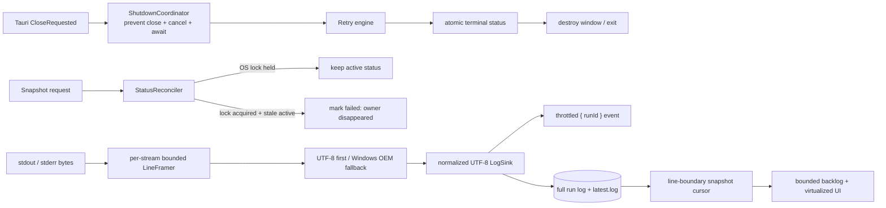

# Codex Launcher Post-package Reliability Fix Plan

- Date: 2026-07-31
- Status: Ready for implementation in a new session
- Scope: shutdown correctness, stale-status recovery, headless observability, log framing/encoding, snapshot backpressure, frontend error delivery, history-cleanup races, first-run safety, and installer cleanup

## 1. Goal

在保持现有产品语义和已通过质量门禁的基础上，修复打包后复审发现的剩余 P1/P2 问题：

- GUI 正常关闭、进程崩溃或断电后，状态必须可恢复，不能永久卡在 `running`。
- Headless/Task Scheduler 必须用真实 exit code 和持久日志报告失败。
- stdout/stderr 必须按 logical line（逻辑行）处理，不能因任意 byte chunk 改写内容或损坏中文。
- 大日志不能造成 event storm、无延迟 IPC replay 或 UI CPU 飙升。
- Backend error 必须排队展示，不能被无关的成功 poll 清除。
- “清历史”在 GUI/headless 并发启动时仍不能删除 active full log。
- Fresh install 不能预置一个可直接执行的测试命令。
- 卸载应用后不能遗留持续指向已删除 EXE 的 Scheduled Task。

## 2. Confirmed defects（已确认问题）

| Severity | Defect | Current evidence | Target outcome |
|---|---|---|---|
| P1 | Close/crash can leave stale active status | `src-tauri/src/main.rs` only cancels in `CloseRequested`; `snapshot.rs` trusts status without checking the OS lock | Graceful close waits for terminal state; crash is reconciled on next poll/startup |
| P1 | Headless failures exit with code 0 and rely on invisible stderr | `main.rs` returns normally from every headless error path; release uses `windows_subsystem = "windows"` | Success=0, failure!=0, stopped has defined code, persistent headless log |
| P1 | Output is framed by arbitrary 8 KiB reads | `retry_engine.rs::pump_stream` emits chunks and `write_output` prefixes/terminates every chunk | Per-stream bounded line framing and deterministic text decoding |
| P1 | Snapshot may split UTF-8 characters and partial lines | `snapshot.rs` applies `from_utf8_lossy(...).lines()` to a fixed byte slice | Cursor advances only over complete UTF-8 records/lines |
| P2 | Backend emits full log chunks that frontend ignores | `LogEvent.line` is serialized for every chunk; frontend only checks `runId` | Throttled lightweight notification payload |
| P2 | Large active log is replayed from byte 0 with zero delay | `hasMore` schedules the next poll at `0` ms | Bounded initial backlog and minimum scheduling delay |
| P2 | Successful snapshot clears unrelated errors | `useTauri.ts` calls `setLastError(null)` after every applied snapshot | Error queue; unrelated success never dismisses an error |
| P2 | Clear-history has a TOCTOU window | Active status is read once before enumeration/deletion | Cross-process maintenance coordination around run log creation and cleanup |
| P2 | Fresh install uses `codex exec ... 111` | `AppConfig::default()` contains an executable sample command | Empty first-run draft; start remains disabled until explicit configuration |
| P2 | App uninstall can orphan a Scheduled Task | Task removal exists only as a GUI command; bundle config has no uninstall cleanup | NSIS/MSI uninstall invokes idempotent task cleanup |
| P3 | `maxTries` wording conflicts with behavior | UI says “重试次数”; engine treats it as total attempts | Preserve stored semantics and relabel as “最大尝试次数” |
| P3 | README uses a machine-specific absolute path | Commands contain `C:\Users\KGMCW\...` | Repository-relative commands |

## 3. Scope and non-goals

### In scope

- `src-tauri/src/main.rs`
- `src-tauri/src/run_manager.rs`
- `src-tauri/src/retry_engine.rs`
- `src-tauri/src/snapshot.rs`
- `src-tauri/src/app_storage.rs`
- `src-tauri/src/config_manager.rs`
- `src-tauri/src/task_scheduler.rs`
- New focused modules such as `status_store.rs` / `windows_text.rs` when they reduce coupling
- `ui/src/hooks/useTauri.ts`
- `ui/src/hooks/logPipeline.ts`
- `ui/src/App.tsx`
- Related unit tests, `tauri.conf.json`, installer hooks, package scripts, README

### Non-goals

- 不改变“任意 Windows shell command”这一产品能力。
- 不引入数据库或多任务队列。
- 不实现 macOS/Linux support。
- 不把完整磁盘日志改成仅保存 tail；磁盘日志仍保留完整 normalized text。
- 不在没有 certificate 的情况下伪造或跳过 Windows code signing trust。
- 不自动执行会修改当前机器 Scheduled Tasks 或安装状态的 manual QA；执行前需要用户明确确认。

## 4. Invariants（修复后必须成立）

1. 任何 accepted run 最终都有 `success`、`failed` 或 `stopped`；进程级 crash 最迟在下次启动/poll 时被 reconcile 为 terminal status。
2. Active OS lock 存在时，任何 reconciliation 都不得改写该 run 的 active status。
3. GUI close 必须先 prevent close、发送 cancellation、等待 terminal persistence，再销毁窗口；等待必须有 bounded timeout。
4. Headless success 返回 `0`；startup/run failure 返回非零；所有 headless failure 写入持久日志。
5. stdout/stderr 的每个普通 logical line 只获得一次 timestamp/source prefix；blank line 不丢失。
6. 单条异常超长输出不能造成 unbounded memory；超过上限时使用显式 continuation fragment。
7. Normalized log 始终是有效 UTF-8；UTF-8 优先，Windows OEM fallback 行为有测试覆盖。
8. Snapshot cursor 永远位于完整 record boundary；不能输出 `�` 或把一个普通逻辑行拆成两行。
9. Log notification payload 不包含完整日志文本，发送频率有上限。
10. GUI reconnect 到超大 active log 时只读取 bounded backlog，并明确显示“较早日志已省略”。
11. Error queue 中的错误只能被明确消费/关闭，不能被 snapshot success 隐式清理。
12. Run-log creation 与 history cleanup 通过 cross-process maintenance lock 串行化。
13. Fresh install 不会在用户未填写 command 时执行任何命令。
14. NSIS/MSI uninstall task cleanup 必须 idempotent：任务不存在也视为成功。

## 5. Target architecture



## 6. Step-by-step implementation checklist

### Phase 0 — Baseline, red tests, and safety snapshot

- [ ] Record `git status --short`; preserve all existing staged/unstaged user changes.
- [ ] Re-run current gates to establish the green baseline.
- [ ] Add failing tests for each P1 before implementation; do not change behavior first.
- [ ] Keep all tests on temp app roots; do not read or write the real `%LOCALAPPDATA%\CodexLauncher`.
- [ ] Do not install/uninstall Scheduled Tasks or packages during automated phases.

Required red tests:

- [ ] Active status + no held OS lock is reconciled to failed.
- [ ] Active status + held OS lock remains active.
- [ ] Headless outcome mapping returns nonzero for config/start/run failure.
- [ ] One read chunk containing multiple lines produces one prefix per line.
- [ ] UTF-8 character split across reads is preserved.
- [ ] OEM/GBK-compatible test bytes decode deterministically on Windows.
- [ ] Snapshot does not advance past an incomplete trailing line.
- [ ] Snapshot preserves blank lines.
- [ ] Concurrent run-log creation and history cleanup never deletes the active log.
- [ ] Two frontend errors survive a successful snapshot and are delivered in order.

### Phase 1 — Lifecycle reconciliation and truthful headless exit

#### 1.1 Centralize status persistence

- [ ] Move `write_status`, HTML rendering, and stale-status mutation into a focused `status_store.rs` (or equivalently cohesive module).
- [ ] Keep JSON and HTML writes atomic; status JSON remains the source of truth.
- [ ] Treat dashboard HTML write failure as visible but do not leave a valid run stuck in `starting` solely because the optional HTML mirror failed.

#### 1.2 OS-lock-backed stale status reconciliation

- [ ] Add a non-destructive `ProcessLock` acquisition path that does not overwrite lock metadata.
- [ ] Reconciliation algorithm:
  1. Read status; return if missing or terminal.
  2. Attempt exclusive OS lock without blocking.
  3. If lock is held, current owner is alive; do nothing.
  4. If lock is acquired, re-read status while holding the lock.
  5. If the same run is still active, write `failed`, clear `childPid`, and explain that the owner exited before terminal persistence.
  6. Release lock.
- [ ] Run reconciliation on GUI startup and before returning active snapshot status, so a headless owner that crashes while GUI is open also heals.
- [ ] Never use stale PID killing as part of reconciliation.

#### 1.3 Graceful GUI shutdown

- [ ] Extend `RunManager::ActiveRun` with completion notification that fires only after terminal status/log flush and lease cleanup.
- [ ] Add async `cancel_local_owned_and_wait(timeout)`.
- [ ] In `CloseRequested`, call `api.prevent_close()` when a local run exists.
- [ ] Use an atomic `closing` guard to avoid recursive close handling.
- [ ] Spawn async shutdown: cancel → await completion → destroy window / exit.
- [ ] Define bounded timeout behavior; on timeout persist a failed/stopped recovery message before forcing exit where possible.
- [ ] Closing a GUI with only a remote headless owner must remain immediate and must not alter remote state.

#### 1.4 Headless outcome and observability

- [ ] Refactor headless flow into a testable helper returning a typed outcome/exit code.
- [ ] Define codes: `0=success`, `1=startup/run failure`, `2=stopped` (or another documented nonzero mapping).
- [ ] Make `main` return `std::process::ExitCode`.
- [ ] Append headless startup/lock/config errors to a persistent `logs/headless.log` using a bounded, reusable helper.
- [ ] Do not depend on `eprintln!` for release Task Scheduler diagnostics.
- [ ] Ensure Task Scheduler “Last Run Result” reflects the real outcome.

Verification:

- [ ] Unit tests for reconciliation under held/unheld lock.
- [ ] Unit tests for completion notification and bounded shutdown wait.
- [ ] Unit tests for all headless exit mappings.
- [ ] Existing cross-process lock tests remain green.

### Phase 2 — Correct log framing, encoding, and snapshot protocol

#### 2.1 Per-stream bounded framing

- [ ] Replace “one read == one log record” with a per-stream `LineFramer`.
- [ ] Feed arbitrary byte chunks into separate stdout/stderr framers.
- [ ] Emit on newline, preserving blank lines; flush the final partial line on EOF.
- [ ] Bound each pending logical line (recommended 256 KiB–1 MiB).
- [ ] If the limit is exceeded, emit an explicit continuation fragment instead of growing memory without bound.
- [ ] Keep stdout/stderr source labels and timestamp each emitted record exactly once.

#### 2.2 Deterministic Windows text decoding

- [ ] Extract the existing Windows code-page conversion into `windows_text.rs` for reuse by retry output and scheduler output.
- [ ] Decode complete record bytes as valid UTF-8 first; otherwise use `CP_OEMCP` on Windows.
- [ ] Remove CR/LF delimiters before decoding and normalize output to UTF-8 with one `\n` per record.
- [ ] Document that disk logs are normalized UTF-8 text, not a byte-identical binary capture.
- [ ] Keep high-demand detection independent from display decoding where possible; scan the ASCII marker across raw chunk boundaries.

#### 2.3 Lightweight, throttled notification

- [ ] Change `LogEvent` to `{ runId }`; remove `line` from Rust and TypeScript.
- [ ] Emit at a bounded cadence (for example, at most once per 100 ms) rather than once per record/chunk.
- [ ] Ensure terminal/status events force one final immediate snapshot.
- [ ] Ignore event delivery failure without affecting disk logging.

#### 2.4 Line-boundary snapshot cursor

- [ ] Latest log must be valid UTF-8 before snapshot reads it.
- [ ] Read at most the configured chunk budget, but only return complete records through the last newline.
- [ ] Keep an incomplete trailing record for the next request by not advancing the byte offset past it.
- [ ] Add a bounded oversized-record fallback consistent with `LineFramer` continuation behavior.
- [ ] Stop filtering empty lines.
- [ ] Use strict UTF-8 decoding and surface invariant violations rather than silently inserting replacement characters.

#### 2.5 Bounded reconnect backlog

- [ ] Add response metadata such as `historyTruncated` when an initial/reconnect request tails a large active log.
- [ ] On `request.runId == null` and a log above the backlog limit (recommended 2 MiB), start near the end and align to the next record boundary.
- [ ] A GUI-owned newly started run still begins at offset 0 and shows its first line.
- [ ] Frontend inserts one semantic marker indicating older content is available on disk.
- [ ] Replace `hasMore → 0 ms` with a small minimum delay or a per-cycle request budget.

Verification:

- [ ] Multiple lines in one OS read.
- [ ] One line across many OS reads.
- [ ] Blank-line preservation.
- [ ] UTF-8 multibyte boundary test.
- [ ] Windows OEM decoding test under `cfg(windows)`.
- [ ] Oversized-line bounded-memory test.
- [ ] Snapshot partial-line and reconnect-tail tests.
- [ ] Event throttle test with paused Tokio time.
- [ ] Full normalized log contains stdout and stderr without arbitrary inserted boundaries.

### Phase 3 — Frontend error delivery and polling control

- [ ] Replace `lastError: string | null` with a small bounded error queue/reducer containing stable IDs and source/action labels.
- [ ] Successful snapshot must not clear the queue.
- [ ] App consumes/dismisses each queued error explicitly after sending it to Sonner.
- [ ] Preserve order for two errors arriving in the same React batch.
- [ ] Make dismiss/report callbacks stable with `useCallback`.
- [ ] Add rejection handling to `listen(...)` setup promises and cleanup promises.
- [ ] Update `LogEvent` type to `{ runId: string }`.
- [ ] Handle `historyTruncated` once per reset without duplicate markers.
- [ ] Enforce the new minimum catch-up delay/request budget in the self-scheduling poller.

Tests:

- [ ] Error reducer keeps two concurrent errors in order.
- [ ] Applied successful snapshot does not remove errors.
- [ ] Dismissing one error does not dismiss another.
- [ ] Truncated-history marker is inserted once.
- [ ] `hasMore` scheduling cannot form a zero-delay busy loop.
- [ ] Existing generation/sequence late-response tests remain green.

### Phase 4 — Cleanup race, first-run safety, and semantic cleanup

#### 4.1 Cross-process maintenance lock

- [ ] Add `maintenance.lock` to `AppPaths`.
- [ ] Implement a short-lived OS-backed maintenance lease.
- [ ] Run start order: acquire run lock → acquire maintenance lock → create/open logs → write starting status → release maintenance lock.
- [ ] Run cleanup order: acquire maintenance lock → re-read active status → enumerate/delete non-active logs → release maintenance lock.
- [ ] Keep `latest.log` protected.
- [ ] If an active log is also protected by Windows file sharing, treat sharing violations as “became active; skip” rather than deleting or aborting the entire cleanup.

#### 4.2 Safe first-run draft

- [ ] Change the fresh default command to empty.
- [ ] Split “load existing persisted config validation” from “fresh unsaved draft”.
- [ ] Existing config files remain strictly validated; corrupted/invalid persisted JSON remains visible and is never silently reset.
- [ ] Fresh missing config may return an incomplete draft so the form renders with Start disabled.
- [ ] Autosave continues only after the draft becomes valid.
- [ ] Do not create a config file containing an executable sample command.

#### 4.3 `maxTries` semantics

- [ ] Preserve existing persisted behavior as total attempts to avoid silently changing retry counts.
- [ ] Relabel UI/documentation/error text to “最大尝试次数（0 为无限）”.
- [ ] Add explicit tests: `1` means one total attempt; `3` means at most three attempts.

#### 4.4 Low-risk UX hardening

- [ ] Validate stored theme values before adding a class to `<html>`.
- [ ] Align frontend URL validation with backend credential rejection.
- [ ] Replace machine-specific README paths with repository-relative commands.

Verification:

- [ ] Concurrent start/clear stress test across independent processes.
- [ ] Fresh missing config returns an empty command without error.
- [ ] Existing invalid config still returns a path-bearing error and remains unchanged.
- [ ] Retry-count semantics tests and updated UI text.

### Phase 5 — Installer and Scheduled Task lifecycle

This phase must begin by consulting current official Tauri 2 NSIS/WiX customization documentation. Do not guess hook names or generated WiX identifiers.

- [ ] Add an idempotent executable mode such as `--uninstall-cleanup`:
  - load app config if present;
  - validate the stored task name;
  - delete the task if it exists;
  - treat “not found” as success;
  - persist cleanup failures to `logs/uninstall.log`;
  - never start the retry engine.
- [ ] Add an NSIS pre-uninstall hook that invokes the installed executable cleanup mode before removing files.
- [ ] Add the equivalent WiX/MSI custom action scheduled before file removal.
- [ ] Ensure uninstall cleanup cannot execute an arbitrary command from config; it may only call the scheduler deletion path with a validated task name.
- [ ] Keep uninstall functional when config/status files are missing or corrupt.
- [ ] Add package scripts:
  - unsigned local bundle for development;
  - signed bundle path that does not force `--no-sign` and requires certificate environment configuration.
- [ ] Do not claim SmartScreen trust until an actual certificate is configured and signatures verify as `Valid`.

Automated verification:

- [ ] Unit-test cleanup outcome mapping with the fake scheduler runner.
- [ ] Build both NSIS and MSI installers.
- [ ] Verify artifacts and SHA-256 hashes.

Manual verification requiring explicit approval / disposable Windows environment:

- [ ] Install NSIS → create task → uninstall → task no longer exists.
- [ ] Install MSI → create task → uninstall → task no longer exists.
- [ ] Uninstall with missing/corrupt config still succeeds.
- [ ] Reinstall/upgrade retains intended app data and does not duplicate tasks.

### Phase 6 — Final quality gates and regression scenarios

Automated gates:

```powershell
Set-Location 'ui'
npm ci
npm run build
npm run lint
npm test
npm audit --omit=dev --registry 'https://registry.npmjs.org'

Set-Location '..\src-tauri'
cargo fmt --all -- --check
cargo clippy --all-targets --all-features -- -D 'warnings'
cargo test --all-targets --all-features
cargo build --release

Set-Location '..\ui'
npm run bundle
```

Security gate:

- [ ] Run `cargo audit` or `cargo deny check advisories` if the tool is available; record inability explicitly rather than silently skipping.

Manual regression matrix:

1. Start a long safe command, close GUI, reopen: terminal status is visible and Start is available.
2. Kill the GUI process while a run is active, reopen: stale status is reconciled to failed without killing unrelated processes.
3. Run headless with invalid config: nonzero exit code and persistent error log.
4. Run `cmd /c echo 中文`: GUI/full log show valid Chinese text without `�`.
5. Emit multiple lines in one write and a line longer than the framing limit: prefixes and continuation markers are correct.
6. Reopen GUI during a multi-GB-equivalent synthetic log: bounded backlog appears quickly without CPU/IPC storm.
7. Trigger autosave and scheduler failures together: both Sonner errors appear.
8. Start headless concurrently with Clear History: active full log remains intact.
9. Fresh install: command is empty and Start is disabled.
10. NSIS/MSI uninstall removes the configured Scheduled Task.

## 7. Expected file changes

### Likely new files

- `src-tauri/src/status_store.rs`
- `src-tauri/src/windows_text.rs`
- `src-tauri/installer/nsis-hooks.nsh` or the exact official Tauri-supported hook location
- WiX fragment/custom-action files required by official Tauri 2 configuration
- Focused frontend reducer/test files if the error queue is extracted

### Existing files

- `src-tauri/src/main.rs`
- `src-tauri/src/app_storage.rs`
- `src-tauri/src/run_manager.rs`
- `src-tauri/src/retry_engine.rs`
- `src-tauri/src/snapshot.rs`
- `src-tauri/src/config_manager.rs`
- `src-tauri/src/task_scheduler.rs`
- `src-tauri/Cargo.toml` / `Cargo.lock`
- `src-tauri/tauri.conf.json`
- `ui/src/hooks/useTauri.ts`
- `ui/src/hooks/logPipeline.ts` and tests
- `ui/src/App.tsx`
- `ui/package.json` / `package-lock.json`
- `README.md`

## 8. Rollback strategy

- Implement and validate one phase at a time; keep diffs cohesive and reviewable.
- Status reconciliation only changes active stale records; terminal records and existing config formats remain compatible.
- New `maintenance.lock` is additive runtime state and may safely remain if a rollback occurs.
- Keep snapshot request/response changes backward-compatible within one coordinated backend/frontend commit; do not ship only one side.
- Logging rewrite must retain the existing log filenames so rollback does not strand user data.
- First-run behavior changes only when no config file exists; never rewrite an existing invalid file to defaults.
- Installer hooks must be isolated from core runtime changes and can be disabled independently if MSI/NSIS validation fails.
- Do not use `git reset --hard`, destructive history rewrites, or delete `%LOCALAPPDATA%\CodexLauncher` during rollback.

## 9. Definition of done

- [ ] All 14 invariants have automated tests or an explicitly recorded manual validation.
- [ ] Close/crash recovery and headless exit semantics are verified.
- [ ] Normal and Chinese command output is correctly framed and decoded.
- [ ] Snapshot/event pipeline remains memory bounded and no longer performs unbounded zero-delay replay.
- [ ] Multiple backend errors are delivered without loss.
- [ ] Concurrent history cleanup cannot delete the active full log.
- [ ] Fresh install has no executable sample command.
- [ ] Both NSIS and MSI uninstall remove the configured Scheduled Task in a disposable environment.
- [ ] Frontend build/lint/tests and Rust fmt/clippy/tests/release build are green.
- [ ] Bundle artifacts are regenerated and checksums recorded.
- [ ] README describes only verified behavior using portable commands.
