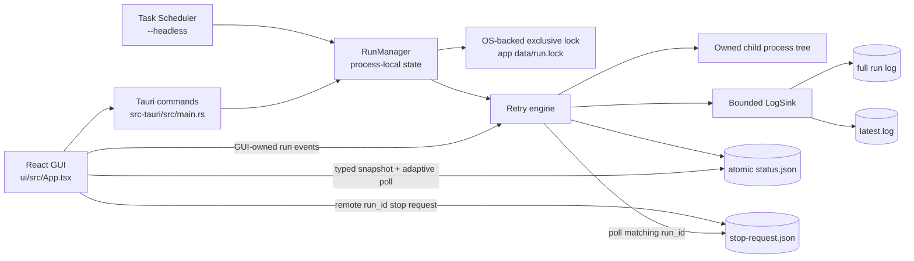

# Codex Launcher Reliability Hardening Plan

- Date: 2026-07-31
- Status: Implemented; automated gates and UI smoke verification passed
- Scope: Rust/Tauri runtime correctness, persistence, log streaming, scheduler safety, React UI reliability, and quality gates

## 1. Goal

在不改变核心产品语义的前提下，修复当前审查发现的高风险问题，并把项目从“可以构建”提升到“单实例可靠、错误可见、长时间运行资源有界、配置可迁移、可自动验证”。

核心产品语义保持不变：

- 用户配置任意 Windows command 和工作目录。
- command 退出码为 `0` 时结束；非零退出或高负载提示时按配置重试。
- GUI 可以启动/停止任务并观察状态、日志。
- Windows Task Scheduler 可以通过 `--headless` 启动同一套引擎。

## 2. Assumptions（假设）与非目标

### Assumptions

- 当前产品仍以 Windows 为唯一支持平台。
- 同一用户、同一应用数据目录在任意时刻最多允许一个 active run。
- correctness（正确性）优先于保留现有内部实现和文件布局。
- 旧 `logs/` 中的数据不能被自动删除；配置迁移必须是 non-destructive（非破坏性）。
- 未实现的 `notify` / 自动打开 dashboard 不在本轮新增功能范围内；先移除死配置和错误文档承诺，保留手动“打开仪表盘”按钮。

### Non-goals

- 不重做整体 UI 视觉设计。
- 不支持 macOS/Linux。
- 不引入数据库。
- 不实现多任务并行队列；仍是 single active run。
- 不把 command execution 改造成 shell-free 参数数组；当前任意 shell command 是产品能力。

## 3. Invariants（必须始终成立的不变量）

1. GUI 与 headless 共享同一个 app-data root，不能因 CWD 不同产生两套配置或状态。
2. 跨进程最多一个 run 持有执行权；检查与占用必须是 atomic（原子）的。
3. `start_retry` 只有在 preflight 和第一次 child spawn 成功后才返回成功。
4. 每个被接受的 run 都必须产生 terminal status：`success`、`failed` 或 `stopped`。
5. GUI 只能停止自己持有的本地 run，或通过带 run ID 的 stop request 请求 headless 自行停止；不能依据未经验证的陈旧 PID 直接杀进程。
6. 新 run 的日志从第一行开始显示；log rotation/truncation 不得丢失开头内容，也不得重复追加。
7. 完整日志可以持续写盘，但 Rust 内存和 React 内存中的日志必须有上限。
8. config/status 写入要么是完整旧版本，要么是完整新版本，不能被读到半截 JSON。
9. 旧版或缺字段的配置可以加载；非法配置必须返回可见错误，不能静默恢复默认值。
10. 更新计划任务失败时，原计划任务仍然存在。
11. “清历史”不能删除当前 active run 的日志。
12. 所有修改后必须通过 build、format、lint、clippy 和新增测试。

## 4. Target architecture（目标结构）



## 5. Expected file changes

### Rust/Tauri

- `src-tauri/src/main.rs`
  - 只保留 command wiring、startup mode 和 window lifecycle。
  - 使用统一 `AppPaths` 和 `RunManager`。
  - 不再在 window close 时无条件删除共享 lock/status。
- `src-tauri/src/app_storage.rs`（新增）
  - 计算 `%LOCALAPPDATA%/CodexLauncher`。
  - legacy config migration。
  - atomic JSON write/read helpers。
- `src-tauri/src/run_manager.rs`（新增）
  - process-local active run reservation。
  - OS-backed cross-process exclusive lock，持有文件句柄直至 run 结束。
  - run-ID-scoped cancellation 和 stop request。
- `src-tauri/src/retry_engine.rs`
  - `RunOptions` / `RunContext` 取代 8/18 参数函数。
  - startup handshake、terminal-state guarantee、bounded output tail。
  - stdout/stderr/cancel 并发处理。
  - 使用 process group/job 终止完整 child tree。
- `src-tauri/src/config_manager.rs`
  - `#[serde(default)]`、配置版本、validation、URL 正规化。
- `src-tauri/src/task_scheduler.rs`
  - 参数验证。
  - 删除 delete-before-create 流程。
  - 命令执行错误保持结构化返回。
- `src-tauri/Cargo.toml`
  - 增加经验证的 OS file-lock/URL/atomic-write 依赖。
  - 使用现有 `command-group` 管理 child tree，若验证后不适用则删除并采用 Windows Job Object。
  - 移除 notification plugin 等未使用依赖。
- `src-tauri/tauri.conf.json`
  - 关闭不需要的 `withGlobalTauri`。
  - 按当前 Tauri 2 官方要求设置最小 CSP。

### React/UI

- `ui/src/hooks/useTauri.ts`
  - 强类型 snapshot/event payload。
  - single-flight adaptive polling，不再以 offset 作为 effect dependency。
  - run ID + byte offset cursor 协议。
  - bounded log buffer。
- `ui/src/App.tsx`
  - 可见错误反馈、输入验证、停止中的真实状态。
  - 当前日志保护和清历史确认。
  - 使用 virtualizer 渲染日志。
  - 修正 Base UI/shadcn composition、spacing 和 icon 属性。
- `ui/src/components/mode-toggle.tsx`
  - Base UI `render` API，移除 `@ts-ignore`。
  - `DropdownMenuGroup` 包裹 items。
- `ui/src/components/ui/*`
  - 仅通过 `npx shadcn@latest` 添加确实需要的 `field`、`input-group`、`sonner`、`alert-dialog`、`spinner`。
  - 添加前先运行 docs/dry-run；不覆盖已有定制组件。
- `ui/package.json` / `ui/package-lock.json`
  - 增加测试脚本和必要测试依赖。
  - 清理未使用 runtime dependencies。
- `ui/vite.config.ts`
  - 用 `import.meta.dirname` 取代未来不兼容的 `__dirname`。

### Repository/docs

- `.gitignore`
  - 将通配 `*.lock` 缩小到 runtime lock 范围，允许提交 `src-tauri/Cargo.lock`。
- `README.md`
  - 更新 app-data 路径、headless 行为、停止语义和真实功能列表。
- `src-tauri/Cargo.lock`
  - 纳入版本控制以保证 application build 可复现。

## 6. Step-by-step implementation checklist

### Phase 0 — Baseline and safety snapshot

- [ ] 记录当前 `git status --short`；不覆盖用户已有未提交修改。
- [ ] 保存 baseline command 输出：frontend build/lint、Rust test/clippy/fmt。
- [ ] 确认 shadcn project context 为 Vite + Tailwind v4 + Base UI + Lucide。
- [ ] 为每个后续 phase 建立独立、可审查的 diff；不混入无关格式化。

Verification:

- Baseline 结果应与审查一致：frontend build 通过，Rust 0 tests，clippy/fmt 当前失败。

### Phase 1 — Unified storage and backward-compatible config

- [ ] 新增 `AppPaths`，统一解析 app root、logs、config、status、lock、stop request。
- [ ] GUI 与 headless 在任何 CWD 下使用同一 app root。
- [ ] 首次启动时：仅当新 config 不存在时，从旧 `<cwd>/logs/launcher-config.json` 复制；不删除旧文件。
- [ ] `AppConfig` 增加 serde defaults 和 `config_version`，旧 JSON 缺字段仍可加载。
- [ ] 增加 `validate()`：command 非空、work directory 存在、interval 合理、max tries 上限、task name/time 格式合法。
- [ ] 使用 URL parser 比较 base URL：scheme/host 大小写不敏感，path 保持大小写语义。
- [ ] config/status 使用 same-directory temp + replace 的 atomic write helper；写入失败向调用方返回错误。
- [ ] 删除所有影响 correctness 的 `let _ = fs::write(...)`。

Tests:

- [ ] 旧配置缺 `allowedBaseUrls` 等字段仍可加载。
- [ ] 损坏 JSON 返回带路径的错误并保留原文件。
- [ ] legacy migration 不覆盖新配置、不删除旧配置。
- [ ] base URL path 大小写测试。
- [ ] atomic writer 不留下被读取的半截 JSON。

### Phase 2 — Run ownership and lifecycle state machine

- [ ] 新增 `RunManager`，用 mutex 管理 local reservation、run ID、cancellation token 和 child PID。
- [ ] 采用 OS-backed exclusive file lock；lock handle 在 run 生命周期内持续持有，进程退出后由 OS 自动释放。
- [ ] acquisition 顺序固定为：validate → acquire cross-process lock → reserve local run → write starting status → spawn first child。
- [ ] 用 oneshot startup handshake：first spawn 成功才让 `start_retry` 返回 `Ok`；失败返回错误并写 `failed`。
- [ ] 用 RAII/finalizer 确保任何 return/panic-safe path 都清理 local reservation、child PID、stop request 和 lock。
- [ ] status 使用 typed enum，禁止任意字符串和互相矛盾的 `status/isRunning`。
- [ ] window close 只取消当前 GUI 进程拥有的 run；不得修改远程 headless run 的 lock/status。
- [ ] remote stop 写入 `{ runId }` stop request；engine 只响应与当前 run ID 匹配的请求。
- [ ] 移除直接依据 lock PID 执行 `taskkill` 的常规流程。
- [ ] 使用 process group/job 确保取消或 app 崩溃时 child descendants 不残留。

Tests:

- [ ] 两个并发 start 只有一个成功。
- [ ] 两个独立进程争抢 lock 只有一个成功。
- [ ] spawn 不存在的 command 返回 error，最终状态为 failed。
- [ ] stale lock 文件但无 OS lock 时可以正常启动。
- [ ] mismatched stop request 不会停止当前 run。
- [ ] window close 不影响另一个 headless owner。

### Phase 3 — Retry engine and bounded logging

- [ ] 用 `RunOptions`、`RunContext` 和 `StatusBuilder` 收敛长参数列表。
- [ ] stdout、stderr、local cancellation、remote stop request 使用 `tokio::select!` 协调，避免双 50ms timeout 轮询。
- [ ] 完整输出流写入文件，但内存仅保留：high-demand flag、最后 N 行或最后 64 KiB preview。
- [ ] `LogSink` 复用打开的 writer，并按短周期/关键状态 flush；避免每行打开两次文件。
- [ ] child output read error 进入明确 failed 状态，不能被当作 EOF。
- [ ] `status.code() == None` 视为异常终止，不能默认成 exit code 0。
- [ ] interval 使用 cancellation-aware sleep，验证乘法不会 overflow。
- [ ] 所有 exit path 统一生成 terminal status 和最后日志。
- [ ] “清历史”读取 active status，排除当前 run log 和 `latest.log`。

Tests:

- [ ] 大量输出时内存 tail 不超过设定上限。
- [ ] stdout/stderr 都能完整写入 full log。
- [ ] exit code 0、非零、高负载、spawn error、cancel 分别产生正确终态。
- [ ] 清历史不会删除 active run log。

### Phase 4 — Snapshot protocol and frontend log pipeline

- [ ] snapshot request 改为 `{ runId?: string, byteOffset: number }`。
- [ ] response 包含 `{ runId, reset, logLines, newByteOffset, status }`。
- [ ] 当 run ID 改变或 offset 大于文件长度时，backend 从 offset 0 读取并返回 `reset=true`。
- [ ] frontend 使用一个 self-scheduling timeout；上一次请求完成后才安排下一次，禁止重叠。
- [ ] 使用 refs 保存 cursor，避免 cursor 更新触发 effect 重建和 immediate busy loop。
- [ ] GUI-owned run 监听 Tauri events 降低延迟；poll 作为 recovery 和 headless 状态来源。
- [ ] 丢弃旧 sequence/run ID 的迟到响应，防止 clear/start 后旧请求覆盖新状态。
- [ ] React 日志仅保留合理上限，例如 2,000–5,000 行；full log 始终在磁盘。
- [ ] 使用已安装的 `@tanstack/react-virtual` 渲染日志列表。
- [ ] auto-scroll 使用 Base UI viewport 的真实 ref/`data-slot`，并尊重用户手动关闭。
- [ ] elapsed time 根据 `startedAt` 在前端本地更新，不依赖每轮重试写 status。

Tests:

- [ ] 文件从 2 KiB 截断到 200 B 后返回新文件完整首段。
- [ ] run ID 切换时日志 reset，不重复、不丢首行。
- [ ] overlapping/迟到响应不会回退 offset 或重复日志。
- [ ] 连续高频日志时 poll 频率保持受控，DOM node 数保持有界。

### Phase 5 — Scheduler safety

- [ ] 后端严格校验 task name 和 `HH:mm`。
- [ ] 直接使用 `schtasks /Create ... /F` 更新，不再提前删除旧任务。
- [ ] create/update 失败时返回 stderr/stdout 和 exit code，但不破坏现有任务。
- [ ] `check_task_status` 返回 `Result<bool, String>`，区分“不存在”和“查询失败/无权限”。
- [ ] 避免通过 `cmd /c` 拼接用户 task name；必要的编码处理与参数执行分离。
- [ ] 安装任务前成功持久化配置；保存失败则不安装。

Tests:

- [ ] 非法时间在调用 `schtasks` 前即失败。
- [ ] 模拟 create 失败时不调用 delete。
- [ ] task name 中 shell metacharacters 不进入 shell command line。

### Phase 6 — UI correctness and shadcn/Base UI cleanup

- [ ] 先运行 `npx shadcn@latest docs` 和 `add --dry-run/--diff`，再添加需要的 components。
- [ ] 配置表单使用 `FieldGroup` + `Field`；浏览目录组合使用 `InputGroup`。
- [ ] 用 `data-invalid` + `aria-invalid` 展示 interval/max tries/time/work-dir validation。
- [ ] 使用 `sonner` 展示 start/stop/save/scheduler/dashboard/log-clean errors；移除手写 toast timer race。
- [ ] 清历史增加 `AlertDialog`，运行中明确说明只删除非活动日志。
- [ ] `DropdownMenuTrigger` 使用 Base UI `render={<Button />}`，移除 `@ts-ignore`。
- [ ] `DropdownMenuItem` 放入 `DropdownMenuGroup`。
- [ ] Button 内 icon 使用 `data-icon`，移除手工尺寸/margin；layout 使用 `gap-*`。
- [ ] status badge 使用现有 variants/semantic tokens，不硬编码 raw emerald/blue colors。
- [ ] 删除 `any` snapshot/config change，补齐 TypeScript types。
- [ ] `checkTask` 只依赖 task name，并加 request sequencing，避免每次 config keypress 查询系统。
- [ ] system theme 监听 `matchMedia` change。

Tests:

- [ ] Base UI theme menu 可点击、键盘操作正常，无 nested button/React warning。
- [ ] auto-scroll 开关有效。
- [ ] 非法数字和时间不能发送到 backend。
- [ ] 连续两个 toast 不会被前一个 timer 提前清除。

### Phase 7 — Security, dependencies, and quality gates

- [ ] 根据 Tauri 2 官方文档设置最小 CSP，并验证 IPC、字体和本地资源仍工作。
- [ ] 关闭 `withGlobalTauri`；frontend 继续使用模块化 `@tauri-apps/api`。
- [ ] 删除未使用的 notification plugin、死配置字段、starter `App.css`/assets 和确认未使用的 dependencies。
- [ ] 将 `shadcn` CLI 放到 dev dependency 或继续仅用 `npx`，不作为 runtime dependency。
- [ ] 修正 `.gitignore` 并提交 `Cargo.lock`。
- [ ] 修复 `cargo fmt`、严格 clippy 和 oxlint warnings。
- [ ] lint script 改为 warnings-as-errors；CI/local gate 使用相同命令。
- [ ] 更新 README，仅描述已实现能力和真实数据路径。

## 7. Validation strategy（最终质量门禁）

### Automated

在 repo root 执行：

```powershell
Set-Location 'C:\Users\KGMCW\Desktop\labeling\工具脚本\codex\ui'
npm ci
npm run build
npm run lint
npm test -- --run

Set-Location '..\src-tauri'
cargo fmt --all -- --check
cargo clippy --all-targets --all-features -- -D warnings
cargo test --all-targets --all-features
cargo build --release
```

Expected result:

- 所有命令 exit code 为 0。
- frontend lint 无 warning。
- Rust tests 不再是 0 tests。
- release binary 成功生成。

### Manual scenarios

1. GUI success：运行一个立即输出并 exit 0 的安全命令，确认状态 success、首尾日志完整。
2. Retry：运行 exit 1 命令，确认间隔和 max tries 正确，停止可在等待期立即生效。
3. Spawn failure：使用不存在的 working directory 或 command，`start_retry` 直接报错且状态 failed。
4. Rotation：先生成较长日志，再开始短任务；新任务第一行必须显示。
5. Cross-process：headless 运行时打开 GUI；GUI start 被拒绝，关闭 GUI 不影响 headless。
6. Remote stop：GUI 对 headless 写 stop request，只有 matching run ID 被停止。
7. Long output：持续输出数分钟，Rust/GUI 内存稳定，界面滚动流畅。
8. Scheduler：先安装有效任务，再尝试非法时间更新；旧任务仍存在。
9. Migration：仅放置 legacy config，启动后新位置出现副本，旧文件保持不变。
10. Packaging：安装 MSI/NSIS 后确认无需写安装目录即可保存配置和日志。

## 8. Rollback strategy（回滚方案）

- 按 phase 分批提交；每个 phase 都必须独立 build/test 通过，便于逐提交回滚。
- storage migration 只 copy，不 move/delete；回滚旧 binary 后 legacy data 仍存在。
- 新 config 添加版本且保留向后兼容字段；不在迁移过程中重写用户旧文件。
- 新 lock/stop request 使用带版本的 JSON；旧 binary 不识别时只会忽略，不应删除用户数据。
- scheduler 修改不提前删除任务，因此失败天然保持旧任务。
- 若 event streaming 出现回归，可临时保留低频 snapshot poll 作为 fallback，但 cursor/run ID 协议不能回滚。
- 不使用 `git reset --hard`、历史重写或批量删除；回滚通过逐提交 revert。

## 9. Definition of done

- [ ] 12 条 invariants 全部由测试或明确 manual scenario 覆盖。
- [ ] P1/P2 审查问题均关闭，或在 PR/变更说明中明确记录剩余风险。
- [ ] 无直接 stale-PID `taskkill` 正常路径。
- [ ] GUI/headless 单实例行为经双进程测试验证。
- [ ] log cursor、bounded memory、atomic persistence 有自动化测试。
- [ ] build/lint/test/clippy/fmt 全绿。
- [ ] README 与真实行为一致。

## 10. Execution result（2026-07-31）

- Phase 0–7 implementation complete。
- Frontend：clean `npm ci`、production build、warnings-as-errors lint、7 tests 全绿。
- Rust：`cargo fmt --check`、strict clippy、24 tests、release build 全绿。
- Browser smoke：Base UI theme menu click/keyboard、system theme persistence、AlertDialog focus/Escape 均通过；0 React warnings。
- Release executable：`src-tauri/target/release/codex-launcher.exe`。
- Bundles：NSIS setup EXE 与 x64 MSI 已成功生成，打包流程可由 `npm run bundle` 复现。
- 未执行会修改机器外部状态的 Task Scheduler 实装/卸载，以及安装包的实际安装/卸载；这些保留为发布前 manual QA。
