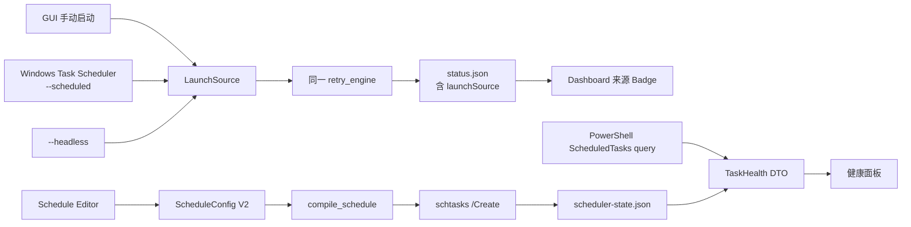

# 运行来源、计划任务健康面板与高级触发器实施计划

- 日期：2026-08-25
- 状态：已实现；自动化验证完成，真实 Windows Scheduled Task Manual QA 待执行
- Scope：Rust/Tauri 状态模型、Windows Task Scheduler 集成、配置迁移、React/shadcn UI、自动化测试与 Windows Manual QA

## 1. 目标

在不拆分现有 retry engine 的前提下增加三项能力：

1. 在 Dashboard 明确展示本次 run 的启动来源：GUI 手动、Windows 计划任务、直接 Headless CLI。
2. 将当前本地化的 `schtasks /Query /V` 文本升级为结构化“计划任务健康面板”。
3. 将单一“每天 HH:mm”扩展为一个可选择的高级触发器，并提供可严格校验的五字段 Cron 子集。

目标数据流：



## 2. 范围与假设

### 2.1 本期支持的触发器

每个 Windows 任务本期只配置一个 trigger（单触发器不变量），支持：

- Daily：每 N 天，在指定本地时间运行。
- Weekly：每 N 周，在一个或多个星期几的指定本地时间运行。
- Monthly：指定月份集合中的某一天，或每月最后一天，在指定本地时间运行。
- Interval：每 N 分钟或每 N 小时运行，可指定对齐起始时间。
- At logon：当前用户登录时运行，可配置延迟。
- At startup：Windows 启动时运行，可配置延迟。
- Cron：标准五字段、Windows 本地时区、能够无损映射为上述单个原生触发器的严格子集。

### 2.2 Cron 子集

格式固定为：

```text
minute hour day-of-month month day-of-week
```

本期接受并编译以下形态：

- `*/N * * * *` → 每 N 分钟。
- `M */N * * *` 或 `M H/N * * *` → 每 N 小时，从 `H:M` 对齐。
- `M H * * *` → 每日一次。
- `M H * * DOW` → 每周指定星期；DOW 支持数字/英文缩写、列表和范围。
- `M H DOM MONTH *` → 每月指定日期与月份集合。

明确拒绝：

- 秒字段或六/七字段 Cron。
- `L`、`W`、`#`、`?` 等扩展语法。
- day-of-month 与 day-of-week 同时受限的 OR 语义。
- 需要生成多个 Windows trigger 才能准确表达的离散分钟/小时组合。
- 显式 timezone；本期始终遵循 Windows 当前本地时区及 DST 规则。

拒绝不支持的表达式比“近似执行”更重要。错误必须指出无法映射的字段，并推荐对应的可视化 trigger 类型。

### 2.3 非目标

- 本期不实现常驻后台 service。
- 不实现多个 trigger 的自由组合。
- 不实现远程机器任务管理、SYSTEM 账号或密码凭据运行。
- 不改变 retry、多 worker、通知和 keep-alive 的业务语义。
- 不在自动化测试中真实创建、运行或删除当前机器的 Scheduled Task。

## 3. Invariants（不变量）

1. GUI、Scheduled Task 和 Headless CLI 必须继续调用同一个 `start_run`/`retry_engine`。
2. 同一时间仍最多只有一个 Codex Launcher run；`run.lock` 的跨进程互斥不得削弱。
3. 运行来源只用于观测，不改变 retry、通知、并发或保活决策。
4. 已经运行的 run 使用启动时的配置快照；编辑配置不热更新当前 run，只有现有“本次保活”远程控制例外。
5. 保存 schedule 配置不得自动修改 Windows Task；只有“安装/更新任务”执行外部变更。
6. 更新现有任务失败时，旧任务仍可继续存在并保持原定义；不能先删后建。
7. 任务改名采用“新建成功并验证 → 记录两者 → 删除旧任务”的顺序，避免失败后无任务或卸载遗留孤儿。
8. 不能覆盖或删除同名但不属于 Codex Launcher 的任务。
9. `TaskHealth` 查询必须 locale-independent；不能再依赖 `/FO LIST /V` 的本地化字段名。
10. 配置、状态和 scheduler state 均使用原子写入；不在这些文件中保存凭据。
11. 老 `configVersion=1` 配置迁移后仍表示原来的 Daily `dailyAt` 行为；迁移本身不重装系统任务。
12. 老 `status.json` 缺少 `launchSource` 时必须正常读取并显示“未知/旧版本”。

## 4. 数据模型与接口

### 4.1 配置 V2

将 `CURRENT_CONFIG_VERSION` 从 `1` 升为 `2`，移除业务模型中的 `daily_at`，增加 tagged enum：

```rust
#[serde(tag = "kind", rename_all = "camelCase")]
pub enum ScheduleConfig {
    Daily { time: String, every_days: u16 },
    Weekly { time: String, every_weeks: u8, days: Vec<Weekday> },
    Monthly { time: String, day: MonthlyDay, months: Vec<Month> },
    Interval { unit: IntervalUnit, every: u16, start_time: String },
    AtLogon { delay_seconds: u32 },
    AtStartup { delay_seconds: u32 },
    Cron { expression: String },
}
```

约束：

- Daily interval：`1..=365`。
- Weekly interval：`1..=52`，days 非空且去重。
- Monthly：月份为空时规范化为全年；日期为 `1..=31` 或 `lastDay`。
- Minute interval：`1..=1439`；hour interval：`1..=23`。
- Startup/logon delay：`0..=9999*60+59` 秒，并转为 `schtasks /DELAY mmmm:ss`。
- 所有有时间字段的类型继续使用严格 `HH:mm`。

迁移流程：

1. 先将 JSON 读为 `serde_json::Value` 并检查 `configVersion`。
2. V1 的 `dailyAt` 转换为 `schedule={kind:"daily",time:dailyAt,everyDays:1}`。
3. 首次保存 V2 前 copy-only 写入 `launcher-config.v1.backup.json`；已存在时不覆盖。
4. 保存时仅写 V2 字段，不继续输出 `dailyAt`。

### 4.2 运行来源

新增：

```rust
pub enum LaunchSource {
    Unknown,
    Gui,
    ScheduledTask,
    HeadlessCli,
}
```

- `TaskStatus` 新增 `launch_source`，使用 `#[serde(default)]` 保持老状态兼容。
- `RunOptions` 新增 source，默认 `Gui`。
- GUI 的普通 retry 和 manual keep-alive 均为 `Gui`；两者仍由 `run_mode` 区分。
- Windows 任务 Action 改为 `"<exe>" --scheduled`。
- 直接执行 `--headless` 标记为 `HeadlessCli`。
- `--uninstall-cleanup` 继续拥有最高参数优先级。
- `status.html` 增加来源字段；通知事件暂不改变标题或发送条件。

### 4.3 Scheduler state

在 `%LOCALAPPDATA%\CodexLauncher\scheduler-state.json` 保存已由应用管理的任务：

```rust
pub struct SchedulerState {
    pub version: u32,
    pub registrations: Vec<ManagedTaskRegistration>,
}

pub struct ManagedTaskRegistration {
    pub task_name: String,
    pub executable_path: String,
    pub applied_schedule: ScheduleConfig,
    pub registered_at: String,
}
```

用途：

- 区分 desired config 与 applied schedule，显示“配置待应用”。
- 在任务改名时跟踪新旧任务，保证 crash 后仍可清理。
- 卸载时清理所有已知 managed registrations，而不只依赖当前 config 名称。
- 只把 action path/arguments 与 Codex Launcher 匹配的任务视为可接管 legacy task。

### 4.4 健康查询 DTO

新增 Tauri command：`get_task_health`，返回结构化数据：

```rust
pub struct TaskHealth {
    pub installed: bool,
    pub state: Option<ScheduledTaskState>,
    pub enabled: bool,
    pub next_run_time: Option<String>,
    pub last_run_time: Option<String>,
    pub last_result: Option<i64>,
    pub last_result_hex: Option<String>,
    pub last_result_label: Option<String>,
    pub missed_runs: u32,
    pub action_path: Option<String>,
    pub action_arguments: Option<String>,
    pub action_matches_app: bool,
    pub managed: bool,
    pub config_drift: bool,
    pub applied_schedule_summary: Option<String>,
    pub desired_schedule_summary: String,
    pub stale_managed_tasks: Vec<String>,
    pub warnings: Vec<String>,
}
```

实现方式：

- 使用内置 Windows PowerShell ScheduledTasks module：`Get-ScheduledTask -TaskPath '\'` 与 `Get-ScheduledTaskInfo`。
- 静态 PowerShell 脚本显式将日期格式化为 ISO-8601，并输出压缩 JSON。
- task name 通过 task-specific environment variable 传入，不插值进脚本文本。
- PowerShell 以 `-NoProfile -NonInteractive -ExecutionPolicy Bypass` 和隐藏窗口启动。
- 不存在返回 `installed=false`；权限、module 或 JSON 解析失败作为真实错误返回。
- 保留现有 raw `schtasks` detail 仅作 debug fallback，不作为 UI 主数据源。

常见 `LastTaskResult` 映射至少覆盖：

- `0x0`：成功。
- `0x1`：应用返回失败。
- `0x2`：应用收到停止请求。
- `0x41300`：Ready。
- `0x41301`：Running。
- `0x41302`：Disabled。
- `0x41303`：尚未运行。
- 其他值保留十六进制与十进制原值，不猜测含义。

## 5. Scheduler 编译与生命周期

### 5.1 Schedule compiler

将 `install_daily_task` 重构为：

```rust
pub async fn install_task(
    task_name: &str,
    schedule: &ScheduleConfig,
    exe_path: &str,
) -> Result<InstallTaskResult, String>
```

内部使用纯函数 `compile_schedule(schedule) -> NativeSchedule`，再构造 `schtasks` 参数：

- `DAILY /MO /ST`
- `WEEKLY /MO /D /ST`
- `MONTHLY /D|/MO LASTDAY /M /ST`
- `MINUTE|HOURLY /MO /ST`
- `ONLOGON|ONSTART /DELAY`

统一 Action：

```text
"<current exe>" --scheduled
```

继续使用 `tokio::process::Command` 的参数数组，不通过 `cmd.exe`/PowerShell 拼接用户值。

### 5.2 Cron compiler

- Cron parser 是纯 Rust、无 I/O、小范围实现，只处理本计划列出的 grammar。
- 先解析并规范化字段，再判断能否无损转换为某个 `NativeSchedule`。
- 对数值、步长、范围、星期映射、月份映射和 overflow 全部有单元测试。
- Cron preview 和实际 schtasks 参数必须来自同一个 backend compiler；前端只做即时基础校验，不能成为权威解析器。

### 5.3 安装/改名

1. 校验 AppConfig、task name、schedule、EXE path。
2. 查询目标任务：
   - 不存在：允许创建。
   - 已在 scheduler state 中：允许更新。
   - 不在 state，但 action 指向当前 EXE 且参数是 legacy `--headless` 或新 `--scheduled`：允许 adoption。
   - 其他同名任务：拒绝覆盖。
3. 用 `/Create ... /F` 创建或更新目标；失败不得删除旧名称。
4. 查询目标健康状态，验证 action path/arguments。
5. 将目标 registration 与所有旧 registration 一起原子写入 scheduler state。
6. 若发生改名，逐个删除旧 managed task；成功后从 state 移除，失败则保留并在结果/健康面板中报告 stale task。

### 5.4 删除与卸载

- GUI “移除任务”只删除已验证为 managed/owned 的目标，并同步 scheduler state。
- 删除任务仍不隐式停止正在运行的 run；UI 必须明确提示“删除注册不会停止当前运行”，停止使用现有 stop command。
- `--uninstall-cleanup` 读取 scheduler state 的全部 registrations，并用 config task name 作为 legacy fallback。
- 不存在视为成功；非 owned 的同名任务跳过并写入 `uninstall.log`，不能误删。
- MSI/NSIS 仍忽略 cleanup failure 以保证卸载可继续，但日志必须保留具体任务名与错误，不记录任何凭据。

## 6. UI/UX

### 6.1 Dashboard 来源标识

- Header 或“系统状态”MetricCard 内增加 `Badge`：
  - `GUI 手动`
  - `Windows 定时任务`
  - `Headless CLI`
  - `来源未知`
- `runMode=manualKeepAlive` 继续单独显示“手动保活”，不要把 mode 与 source 混为一列。
- Scheduled run 被 GUI 观察时，停止按钮和“本次保活”保持可用。

### 6.2 高级触发器编辑器

新增 `ui/src/components/scheduler/schedule-editor.tsx`：

- 使用 shadcn `FieldGroup`、`Field`、`Select`、`ToggleGroup`、`Checkbox`、`Input`。
- Trigger 类型切换时只保留该类型字段，避免隐藏字段继续影响校验。
- Weekly 使用星期 ToggleGroup；Monthly 使用日期/最后一天和月份选择。
- Cron 提供 expression 输入、支持范围说明、有效 schedule preview 和明确的 unsupported message。
- 页面显示“保存配置”与“应用到 Windows Task”是两件事。

执行前按 shadcn skill：

```powershell
Set-Location 'D:\Study\Rust\Codex-Launcher\ui'
npx shadcn@latest docs select checkbox toggle-group alert
npx shadcn@latest add select checkbox toggle-group alert --dry-run
```

确认 diff 后再添加缺失组件；不得覆盖已有定制组件。

### 6.3 健康面板

新增 `ui/src/components/scheduler/task-health-panel.tsx`，展示：

- 总体：Healthy / Running / Warning / Missing。
- 是否安装、Enabled/Disabled、Windows State。
- 下一次/上一次运行时间。
- Last Run Result 的中文解释与原始 hex。
- Missed Runs。
- Action path 与 arguments，是否匹配当前应用。
- Desired schedule 与 Applied schedule；不一致时提示“配置待应用”。
- stale managed tasks 警告。
- 手动刷新按钮；在加载、安装、更新、删除、task name 变化后刷新。

不周期启动 PowerShell 做高频 polling。当前 run 的实时状态继续使用已有 snapshot 400ms polling；Windows 健康数据按需刷新。

## 7. 预计修改文件

| 文件 | 修改内容 |
|---|---|
| `src-tauri/src/config_manager.rs` | Config V2、ScheduleConfig、V1→V2 migration、验证与测试 |
| `src-tauri/src/app_storage.rs` | scheduler state 与 V1 backup 路径 |
| `src-tauri/src/task_scheduler.rs` | schedule/cron compiler、安装生命周期、健康查询、ownership、测试 |
| `src-tauri/src/retry_engine.rs` | LaunchSource 进入 RunOptions/TaskStatus |
| `src-tauri/src/main.rs` | `--scheduled` launch mode、新 commands、install/delete/cleanup wiring |
| `src-tauri/src/status_store.rs` | status.html 来源展示 |
| `src-tauri/src/snapshot.rs` | TaskStatus fixture/compatibility tests |
| `ui/src/hooks/useTauri.ts` | V2 types、TaskHealth state/refresh、LaunchSource |
| `ui/src/hooks/configValidation.ts` | 各 trigger 与 Cron 基础校验 |
| `ui/src/hooks/configValidation.test.ts` | schedule validation tests |
| `ui/src/App.tsx` | 来源 Badge、组合 ScheduleEditor/TaskHealthPanel |
| `ui/src/components/scheduler/schedule-editor.tsx` | 新增高级触发器编辑器 |
| `ui/src/components/scheduler/task-health-panel.tsx` | 新增结构化健康面板 |
| `ui/src/components/ui/*` | 仅通过 shadcn CLI 添加确认缺失的组件 |
| `README.md` | 配置 V2、触发器/Cron 范围、健康状态、Manual QA |

如实现中发现 task scheduler 文件继续膨胀，可仅按职责拆成：

- `task_scheduler/schedule.rs`
- `task_scheduler/health.rs`
- `task_scheduler/state.rs`

不要提前创建更多抽象层。

## 8. 分阶段实施清单

### Phase 1 — 配置模型与 migration

- [ ] 定义 ScheduleConfig 与辅助 enum。
- [ ] 实现统一 schedule validation/summary。
- [ ] 实现 V1 dailyAt → V2 Daily migration 与 copy-only backup。
- [ ] 更新 Rust/TypeScript 默认配置。
- [ ] 覆盖缺字段、损坏 JSON、未来版本、迁移幂等测试。

### Phase 2 — 运行来源

- [ ] 新增 LaunchSource，并兼容旧 status JSON。
- [ ] `--scheduled` 参数贯穿 `run_headless` → RunOptions → TaskStatus。
- [ ] 更新 status HTML 与前端 Badge。
- [ ] 测试 GUI、Scheduled、Headless CLI、UninstallCleanup 参数优先级。

### Phase 3 — schedule/Cron compiler

- [ ] 将现有 daily schtasks args 提取为 NativeSchedule compiler。
- [ ] 实现 Daily/Weekly/Monthly/Interval/Logon/Startup。
- [ ] 实现严格五字段 Cron 子集与 schedule preview。
- [ ] 对所有边界和拒绝案例写纯单元测试。
- [ ] 保持 fake SchedulerRunner，不触碰真实系统任务。

### Phase 4 — managed registration lifecycle

- [ ] 增加 scheduler-state.json 与原子读写。
- [ ] 增加 ownership/action path 校验。
- [ ] 实现 crash-safe 改名顺序与 stale registration 保留。
- [ ] 更新 GUI remove 和 installer cleanup。
- [ ] 测试 create failure、verify failure、old delete failure、missing state、legacy adoption。

### Phase 5 — 健康查询

- [ ] 实现静态 PowerShell JSON query 与 runner abstraction。
- [ ] 解析 state、runtime info、action 和 common result codes。
- [ ] 合并 scheduler state，生成 drift/stale/warnings。
- [ ] 保留 raw detail debug fallback。
- [ ] 覆盖 missing、ready、running、disabled、failed、permission failure、malformed JSON 测试。

### Phase 6 — React/shadcn UI

- [ ] 按 CLI docs/dry-run 流程添加必要组件。
- [ ] 实现 ScheduleEditor 与即时校验。
- [ ] 实现 TaskHealthPanel 与 refresh 状态。
- [ ] Dashboard 增加 LaunchSource Badge。
- [ ] 安装/更新/删除后刷新健康状态。
- [ ] 清楚区分“停止当前 run”和“删除 Windows 注册”。

### Phase 7 — 文档与回归

- [ ] 更新 README 架构图、配置示例、Cron 支持矩阵和迁移说明。
- [ ] 运行完整 Rust 与前端质量门禁。
- [ ] 在 disposable Windows 环境完成外部状态 Manual QA。

## 9. 自动化验证

从 repository root：

```powershell
Set-Location 'D:\Study\Rust\Codex-Launcher'
cargo fmt --manifest-path 'src-tauri/Cargo.toml' -- --check
cargo test --manifest-path 'src-tauri/Cargo.toml'
cargo clippy --manifest-path 'src-tauri/Cargo.toml' --all-targets -- -D warnings

Set-Location 'D:\Study\Rust\Codex-Launcher\ui'
npm test
npm run build
npm run lint
```

关键自动化 acceptance tests：

1. V1 `{dailyAt:"08:40"}` 迁移为 V2 Daily，原文件 backup 只创建一次。
2. 老 status 缺少 launchSource 时仍可读取。
3. `--scheduled` 创建的 status 标记 ScheduledTask，`--headless` 标记 HeadlessCli。
4. 每种 ScheduleConfig 生成精确且无 shell 拼接的 schtasks 参数。
5. 支持的 Cron 示例与等价可视化 schedule 生成相同 NativeSchedule。
6. 不支持的 Cron 不调用 schtasks。
7. 同名非 owned task 不会被覆盖或删除。
8. 改名时新任务创建失败不会删除旧任务。
9. 改名后旧任务删除失败会保留在 scheduler state，并出现在 health warning。
10. 健康查询不依赖操作系统显示语言。
11. Scheduled run 在 GUI 中可观察、远程停止、切换本次保活；关闭 GUI 不停止它。

## 10. Manual QA boundary

仅在 disposable Windows environment 执行：

1. 从 V1 配置升级，确认 schedule 显示 Daily 08:40，Windows 旧任务没有被 migration 自动修改。
2. 分别安装 Daily、Weekly、Monthly、Minute interval、Hourly interval、At logon、At startup。
3. 对每种类型用 Task Scheduler GUI 和 `schtasks /Query /XML` 核对 trigger/action。
4. 安装受支持的 Cron 示例并核对 Next Run Time。
5. 输入不受支持的 Cron，确认不会覆盖现有任务。
6. 从 Task Scheduler “Run”启动，打开 GUI，确认来源显示“Windows 定时任务”、日志实时更新、Stop/KeepAlive 可控制。
7. 直接运行 `--headless`，确认来源显示“Headless CLI”。
8. 禁用任务、制造非零 Last Run Result、触发 missed run，确认健康面板警告与 raw code 正确。
9. 修改 schedule 但不点击应用，确认显示 config drift；应用后清除 drift。
10. 改名任务，确认新任务先成功，旧任务随后删除；模拟旧任务删除失败，确认 stale warning。
11. 创建同名外部任务，确认应用拒绝覆盖和删除。
12. NSIS/MSI uninstall 清理所有 managed registrations；正在运行的 run 需单独验证并记录删除注册不会中断进程。

## 11. Rollback（回滚）

- 代码回滚：整组变更应保持为一个 reviewable feature commit，必要时整体 revert。
- 配置回滚：停止应用，将 `launcher-config.v1.backup.json` 复制回 `launcher-config.json` 后再启动旧版；不要让旧版直接读取 V2。
- Scheduler 回滚：使用旧版前，在新版本 UI 移除高级任务，然后用 V1 backup 的 `dailyAt` 重新创建 Daily task。
- Runtime state：`scheduler-state.json` 只包含非敏感注册信息；确认 Windows 任务已清理后可删除该文件。
- 安装失败：不得自动回滚到“无任务”；旧任务保持可运行，新失败信息通过 UI/日志报告。

## 12. 风险与控制

| 风险 | 控制措施 |
|---|---|
| Cron 语义与 Task Scheduler 不一致 | 只接受可无损映射的子集；拒绝近似执行；共享 compiler/preview |
| 配置 V2 导致旧版无法启动 | copy-only V1 backup + README rollback procedure |
| 任务改名遗留旧注册 | scheduler state 记录全部 managed task，新建成功后再清理旧名称 |
| 覆盖用户同名任务 | ownership/action 验证，未知任务拒绝 `/F` 和 `/Delete` |
| PowerShell 输出受 locale 影响 | 显式构造 JSON/ISO 日期，不解析展示文本 |
| 高频健康轮询开销 | 健康数据按需刷新；实时运行仍走已有 snapshot |
| Schedule UI 与 backend 规则漂移 | Rust 为权威 validator/compiler，TS 仅做即时反馈，端到端错误照常展示 |
| Headless 无限运行被 Windows 默认时限停止 | 健康面板展示 Execution/Last Result；本期不偷偷改变现有 Task Scheduler settings |

## 13. 完成标准

- Dashboard 能可靠区分 GUI、Scheduled Task 与 Headless CLI。
- 计划任务页不再把“存在”当作“健康”，能结构化展示 state、next/last run、result、missed runs、ownership 和 drift。
- 所有本期定义的高级触发器可安装、更新、查询和卸载。
- 支持的 Cron 表达式严格等价；不支持表达式在任何外部写操作前失败。
- 配置 V1、旧 status 和 legacy daily task 均有明确兼容路径。
- 自动化质量门禁全部通过，并完成 disposable Windows Manual QA 后才可发布。
